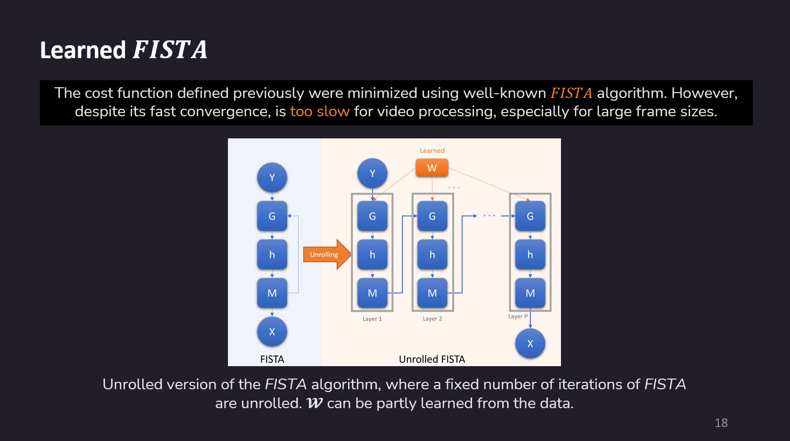

# LFISTA

Implementation of Learned Fast Iterative Shrinkage Thresholding Algorithm (LFISTA) from academic papar: [Unsupervised Model-Based Learning for Simultaneous Video Deflickering and Deblotching](https://openaccess.thecvf.com/content/WACV2024/html/Fulari_Unsupervised_Model-Based_Learning_for_Simultaneous_Video_Deflickering_and_Deblotching_WACV_2024_paper.html).

## Slides from Presentation:

 

 

